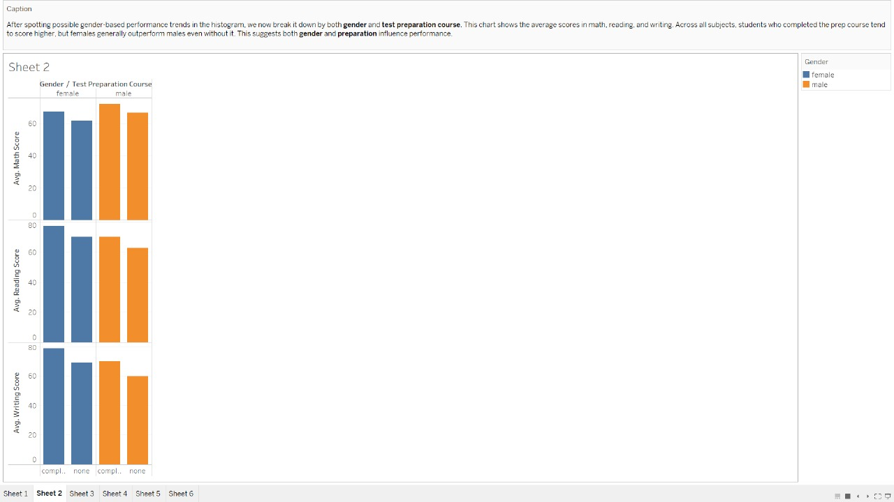
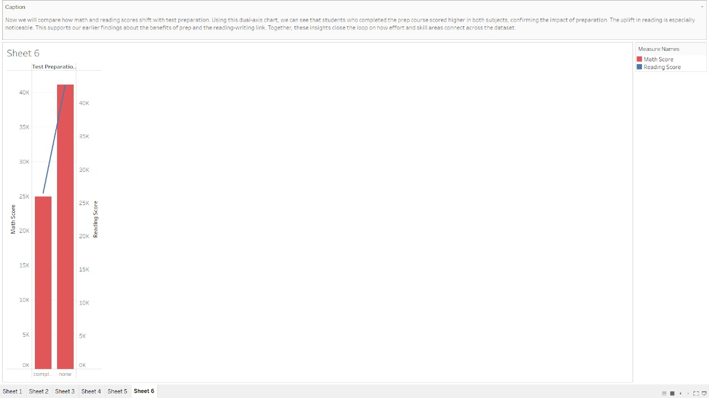

# 🧪 Exploratory Data Analysis (EDA)

This section explores patterns, trends, and relationships in the student performance dataset using Tableau. The goal is to build an understanding of key factors influencing student scores before modeling.

---

## 📊 Graph 1 – Math Score Distribution by Gender

We start by looking at how students perform in Math and how scores differ between genders. The histogram shows most students score between 50–80, with a near-normal, bell-shaped curve. Female students seem slightly more represented in higher bins, hinting at a possible performance gap. This gives us an early clue that gender could influence outcomes.

---

## 📊 Graph 2 – Average Scores by Gender & Test Prep

This grouped bar chart lets us compare average Math, Reading, and Writing scores by gender and test preparation. Across all categories, students who completed the prep course scored higher. Female students with test prep consistently perform best, especially in Writing.

---

## 📊 Graph 3 – Boxplot of Math Scores

Boxplots allow us to examine the spread and outliers of Math scores. Males show a wider distribution and more extreme scores. Females who completed the test prep have the highest median. This confirms consistent trends seen in Graph 2.

---

## 📊 Graph 4 – Reading vs Writing Scores (Scatter Plot)

A strong positive linear relationship exists between Reading and Writing scores. Students who read more likely write better — a pattern seen in both genders. Prep course completers also trend higher.

---

## 📊 Graph 5 – Multivariate Distribution: Math, Reading & Writing

This view overlays Reading and Writing scores by gender, prep status, and Math score distribution. Female students with prep course show the most consistent high scores across all three subjects. Male scores show more variation, especially without prep.

---

## 📊 Graph 6 – Dual Axis: Math vs Reading by Test Prep

This dual-axis chart compares average Math and Reading scores based on test preparation. Both scores increase with prep, but Reading shows a steeper gain. Suggests that the prep course may especially help with Reading skills.

---

## ✅ Conclusion

Our analysis suggests:
- Most students fall in the 50–80 range across subjects.
- Gender and test preparation influence scores.
- Strong relationship exists between Reading and Writing.
- Female students with test prep show consistently high performance.

Next, we’ll move into **feature engineering and modeling** using these EDA insights.

